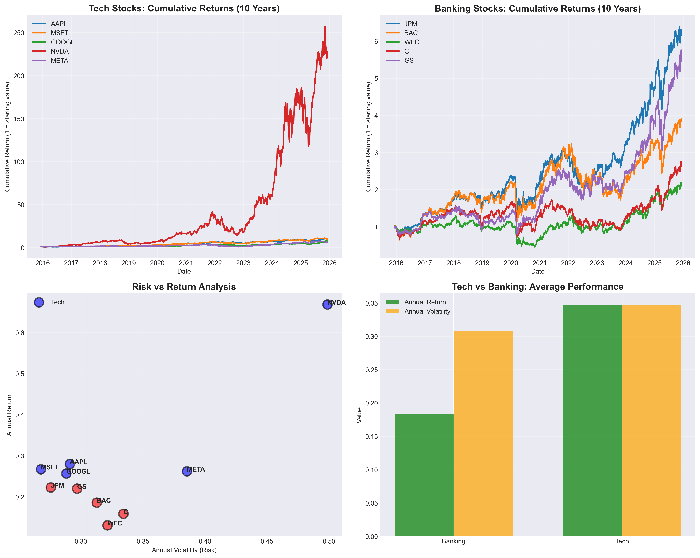

# Stock Market Trend Analysis: Tech vs Banking (2015-2025)

## 📊 Project Overview

A comprehensive 10-year comparative analysis of technology and banking sector stocks using Python, Pandas, and data visualization. This project analyzes historical stock performance, calculates risk-adjusted returns, and identifies key trends across two major market sectors.

## 🎯 Analysis Goals

- Compare long-term performance of tech vs banking stocks
- Calculate risk-adjusted returns (Sharpe-like ratios)
- Identify top performers and assess volatility
- Analyze sector correlations and diversification benefits
- Visualize cumulative returns and risk/return relationships

## 📈 Stocks Analyzed

**Technology Sector:**
- AAPL (Apple)
- MSFT (Microsoft)
- GOOGL (Google/Alphabet)
- NVDA (Nvidia)
- META (Meta/Facebook)

**Banking Sector:**
- JPM (JPMorgan Chase)
- BAC (Bank of America)
- WFC (Wells Fargo)
- C (Citigroup)
- GS (Goldman Sachs)

## 🔑 Key Findings

### Top Performer
- **NVDA (Nvidia):** 66.8% annual return with 49.9% volatility
- Return/Risk Ratio: 1.34 (highest among all stocks)
- Explosive growth driven by AI boom (2023+)

### Sector Comparison
- **Tech Average Return:** 34.7%
- **Banking Average Return:** 18.3%
- **Tech Outperformance:** +16.3 percentage points
- **All 5 tech stocks outperformed all 5 banking stocks**

### Risk Analysis
- Tech and banking sectors show weak correlation (0.496)
- Provides diversification benefits for mixed portfolios
- Banking stocks demonstrated lower returns despite similar volatility levels

### Market Insights
1. Technology sector dominated the 10-year period with 34.7% average annual returns
2. NVDA led all stocks with 66.8% annual growth, particularly explosive post-2023
3. Banking sector struggled with lower returns (18.3%) despite comparable risk
4. COVID-19 (2020) significantly impacted banking stocks with slower recovery
5. AI revolution (2023+) created massive divergence in tech stock performance

## 📊 Visualizations



**Chart Descriptions:**
- **Top-Left:** Tech stocks cumulative returns showing NVDA's 250x growth
- **Top-Right:** Banking stocks cumulative returns with more modest 2-7x growth
- **Bottom-Left:** Risk vs Return scatter plot highlighting tech's superior positioning
- **Bottom-Right:** Sector comparison showing tech's clear performance advantage

## 🛠️ Technical Implementation

**Tools & Libraries:**
- **Python 3.12**
- **pandas:** Data manipulation and analysis
- **numpy:** Numerical computations
- **matplotlib:** Data visualization
- **yfinance:** Historical stock data retrieval

**Key Metrics Calculated:**
- Daily returns using percent change
- Annualized returns (mean daily return × 252 trading days)
- Annualized volatility (standard deviation × √252)
- Return/Risk ratios (Sharpe-like measure)
- Cumulative returns over 10-year period
- Sector correlation coefficients

## 📁 Project Structure
```
stock-market-trend-analysis/
│
├── stock_analysis.ipynb          # Main analysis notebook
├── stock_analysis.png            # Visualization output
└── README.md                     # Project documentation
```

## 🚀 How to Run

1. Clone this repository
2. Install required libraries: `pip install pandas numpy matplotlib yfinance`
3. Open `stock_analysis.ipynb` in Jupyter Notebook or VS Code
4. Run all cells to reproduce the analysis

## 💡 Business Applications

This analysis demonstrates skills applicable to:
- **Portfolio Management:** Identifying optimal asset allocation strategies
- **Risk Assessment:** Quantifying and comparing investment volatility
- **Sector Analysis:** Understanding industry-level performance trends
- **Data-Driven Decision Making:** Supporting investment recommendations with quantitative evidence

## 📧 Contact

**Zachary Bradley **
- LinkedIn: www.linkedin.com/in/zachary-bradley-communications
- GitHub: www.github.com/zachary-bradley
- Email: zach9508@gmail.com

---

*Analysis completed December 2025. Data source: Yahoo Finance via yfinance API. Assistance provdided by Anthropic's Claude*
